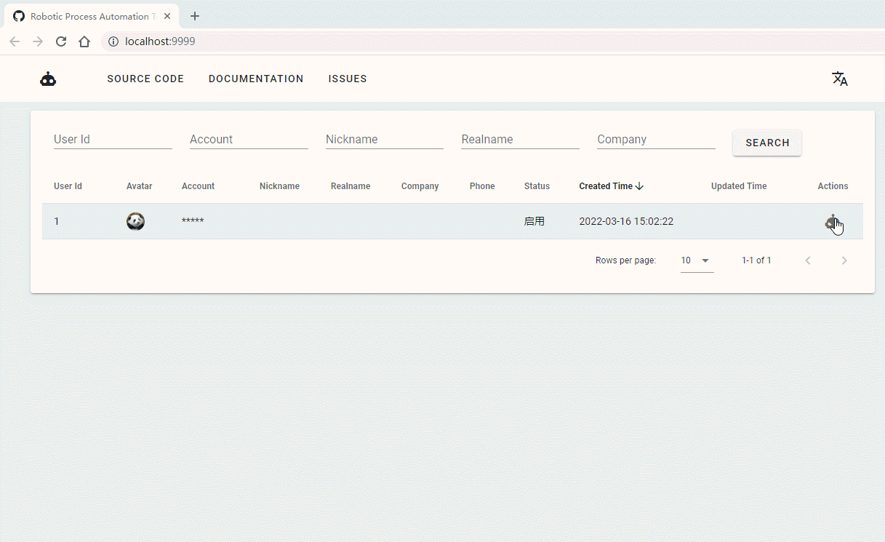
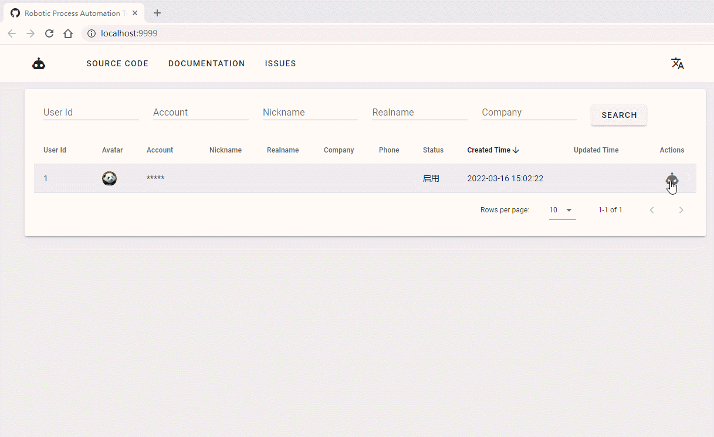
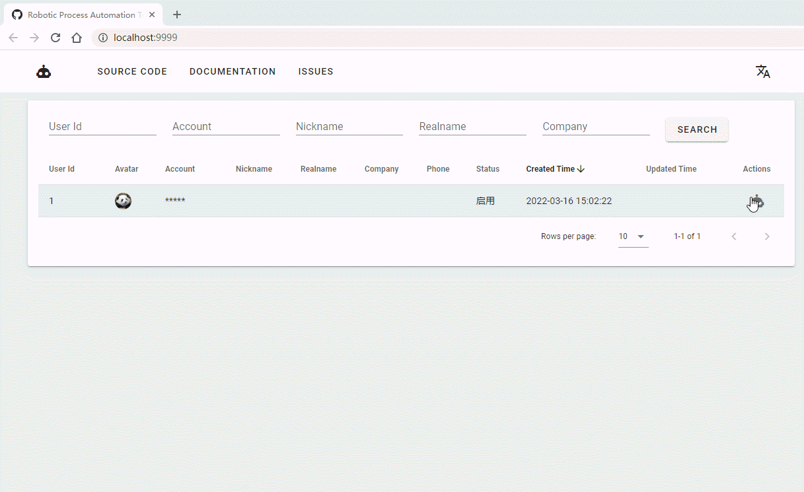
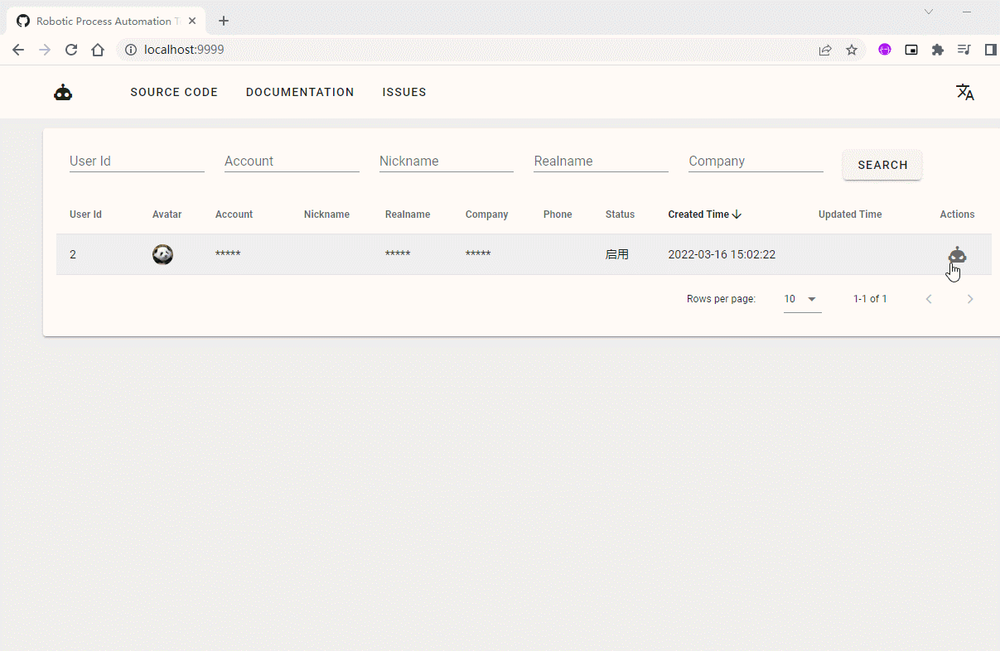
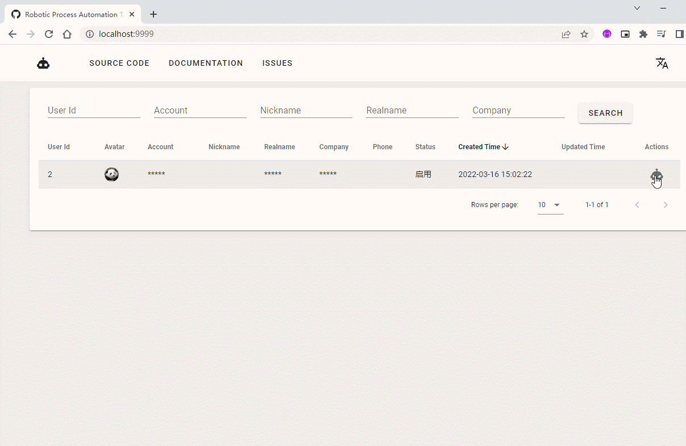
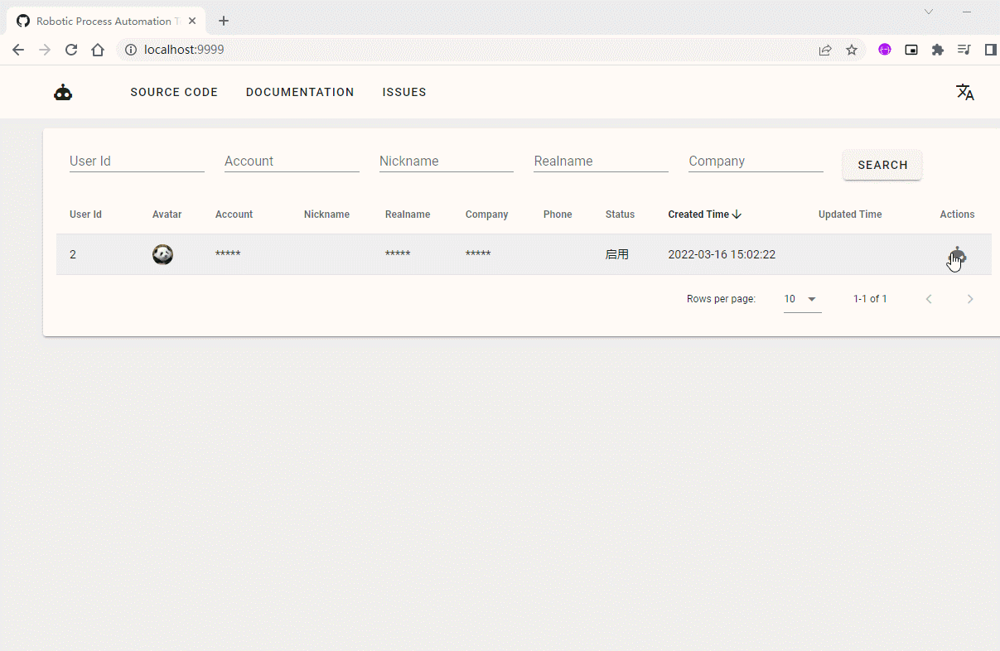
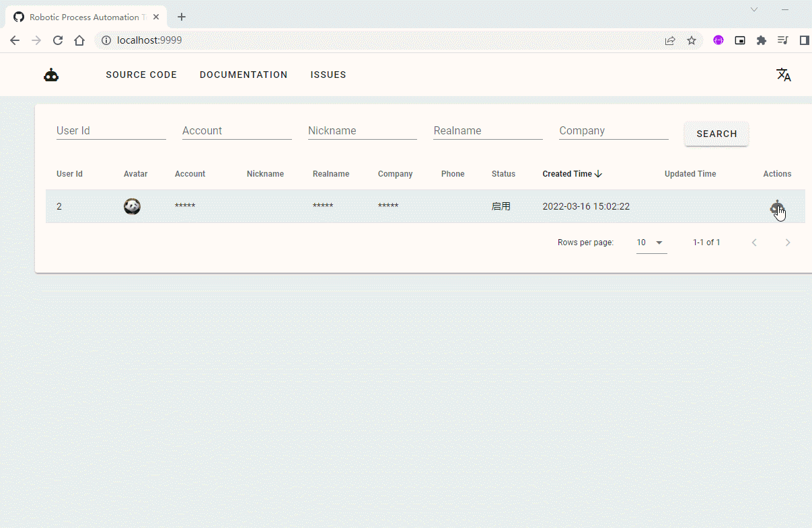
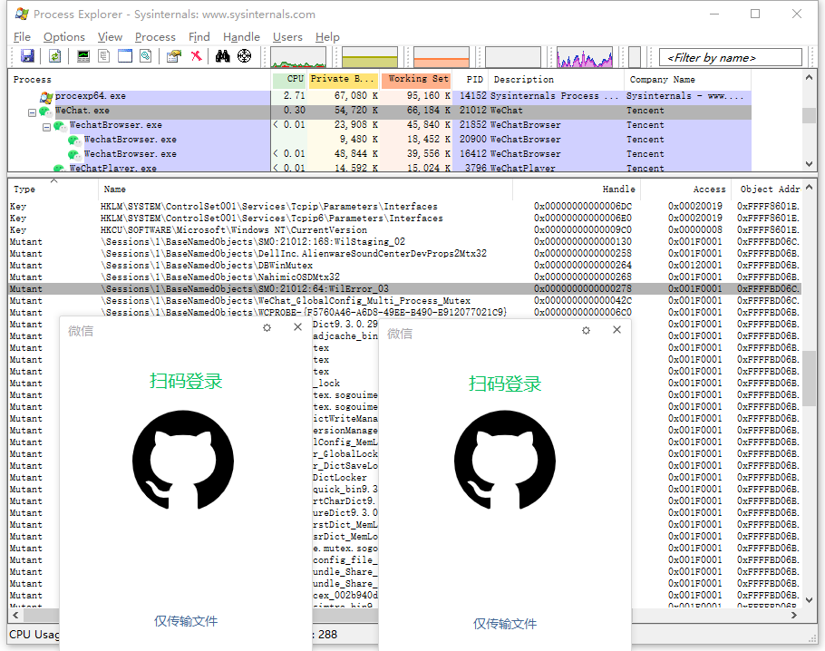
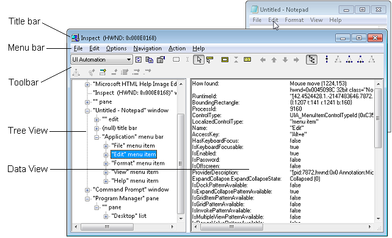

# Robotic Process Automation

机器人流程自动化 (RPA)，像人类工作者一样，通过跨各种应用程序运行的软件或硬件系统实现任务自动化。软件或机器人可以学习具有多个步骤和应用程序的工作流程，例如获取收到的表格、发送回执消息、检查表格的完整性、将表格归档到文件夹中以及使用表格名称更新电子表格，提交日期等。RPA软件旨在减轻员工完成重复性简单任务的负担。

## Usage

### 客户端自动化使用介绍

请确保本地计算机已安装对应客户端，且`rpa-client`与`rpa-server`均已启动。

当前系统支持以下客户端：

|  AppId   | Name |
|:--------:|:----:|
|  wechat  |  微信  |
|  wecom   | 企业微信 |
|    qq    | 腾讯QQ |
|   tim    | TIM  |
| dingtalk |  钉钉  |
|   lark   |  飞书  |

由于任务必须通过指定用户去执行，所以在执行任务之前，需要确保用户存在。

#### 1. 创建用户

##### 通过HTTP接口创建用户

- 接口：`http://<host>:<port>/users`
- 方法：`POST`
- 格式：`JSON`
- 参数：`Body`

| Property   | Type   | Required | Description         |
|:-----------|:-------|:---------|:--------------------|
| users      | User[] | 必填       | 用户对象数组。             |
| └ id       | String | 可选       | 用户ID。为空时服务端会自动生成ID。 |
| └ appId    | String | 必填       | 关联AppID。            |
| └ account  | String | 必填       | 用户账号，用于匹配客户端。       |
| └ nickname | String | 可选       | 用户昵称，用于展示。          |
| └ realname | String | 可选       | 用户真实名称，用于展示。        |
| └ company  | String | 可选       | 用户所属公司名称，用于展示。      |

> 注意，`企业微信`客户端中无法直接获取当前登录人的`account`，当前是通过`${realname}_${company}`组合匹配客户端。

接口示例：

```shell
curl -X POST --location "http://localhost:8080/users" \
    -H "Content-Type: application/json" \
    -d "{
          \"users\": [
            {
              \"id\": \"uid\",
              \"appId\": \"wechat\",
              \"account\": \"account\",
              \"nickname\": \"nickname\"
            }
          ]
        }"
```

##### 通过SQL脚本创建用户

```sql
insert into user (id, app_id, account, nickname, realname, company, status, created_time, updated_time)
values ('uid', 'wechat', 'account', 'nickname', 'realname', 'company', 1, now(), null);
```

#### 2. 创建任务

##### 通过HTTP接口创建任务

- 接口：`http://<host>:<port>/tasks`
- 方法：`POST`
- 格式：`JSON`
- 参数：`Body`

| Property       | Type     | Required | Description                                |
|:---------------|:---------|:---------|:-------------------------------------------|
| tasks          | Task[]   | 必填       | 任务对象数组。                                    |
| └ id           | String   | 可选       | 任务ID。为空时服务端会自动生成ID。                        |
| └ userId       | String   | 必填       | 关联用户ID。                                    |
| └ type         | String   | 必填       | 任务类型，参考[任务类型字典表](TASKTYPES.md)。            |
| └ priority     | Integer  | 可选       | 任务优先级，值越小越优先。为空时取默认配置的优先级。                 |
| └ data         | String   | 可选       | 任务数据，格式为`JSON`字符串。                         |
| └ scheduleTime | DateTime | 可选       | 任务执行时间，例如：`2022-01-01 10:00:00`。为空时会被立即执行。 |

示例：

```shell
curl -X PATCH --location "http://localhost:8080/tasks" \
    -H "Content-Type: application/json" \
    -d "{
          \"tasks\": [
            {
              \"id\": \"tid\",
              \"userId\": \"uid\",
              \"type\": \"login\",
              \"priority\": \"0\",
              \"data\": \"\",
              \"scheduleTime\": \"2022-01-01 10:00:00\",
            }
          ]
        }"
```

##### 通过SQL脚本创建任务

```sql
insert into task (id, user_id, app_id, type, priority, data, status, created_time, updated_time, schedule_time)
values ('tid', 'uid', 'wechat', 'login', 0, null, 0, now(), null, '2022-01-01 10:00:00');
```

### 微信客户端自动化

服务端提供了一个运行时的测试页面，开发者可以用它在本地测试简单任务。
打开浏览器访问`http://<host>:<port>/index.html`，然后选择待测试的客户端即可。

#### 微信客户端登录任务

*登录客户端不需要参数*



#### 微信客户端登出任务

*登出客户端不需要参数*



#### 微信客户端发送个人消息任务

参数格式：

| Property  | Type      | Required | Description     |
|:----------|:----------|:---------|:----------------|
| target    | String    | 必填       | 发送对象。           |
| messages  | Message[] | 必填       | 消息对象数组。         |
| └ type    | String    | 必填       | 消息类型。           |
| └ content | String    | 必填       | 消息内容，文本内容或文件地址。 |

消息类型：

| Code    | Name    | Description |
|:--------|:--------|:------------|
| text    | TEXT    | 文本          |
| image   | IMAGE   | 图片          |
| video   | VIDEO   | 视频          |
| file    | FILE    | 文件          |

参数示例：

```json
{
  "target": "friend",
  "messages": [
    {
      "type": "text",
      "content": "message"
    },
    {
      "type": "image",
      "content": "https://rpa.leego.io/image.png"
    },
    {
      "type": "video",
      "content": "https://rpa.leego.io/video.mp4"
    },
    {
      "type": "file",
      "content": "https://rpa.leego.io/file.zip"
    }
  ]
}
```


#### 微信客户端发送群消息任务

参数格式：

| Property  | Type      | Required | Description     |
|:----------|:----------|:---------|:----------------|
| target    | String    | 必填       | 群名称。            |
| messages  | Message[] | 必填       | 消息对象数组。         |
| └ type    | String    | 必填       | 消息类型。           |
| └ content | String    | 必填       | 消息内容，文本内容或文件地址。 |

消息类型：

| Code    | Name    | Description |
|:--------|:--------|:------------|
| text    | TEXT    | 文本          |
| image   | IMAGE   | 图片          |
| video   | VIDEO   | 视频          |
| file    | FILE    | 文件          |
| mention | MENTION | 提醒          |

参数示例：

```json
{
  "target": "group",
  "messages": [
    {
      "type": "text",
      "content": "message"
    },
    {
      "type": "image",
      "content": "https://rpa.leego.io/image.png"
    },
    {
      "type": "video",
      "content": "https://rpa.leego.io/video.mp4"
    },
    {
      "type": "file",
      "content": "https://rpa.leego.io/file.zip"
    },
    {
      "type": "mention",
      "content": "member"
    }
  ]
}
```



### 企业微信客户端自动化

#### 企业微信客户端登录任务

*登录客户端不需要参数*



#### 企业微信客户端登出任务

*登出客户端不需要参数*



#### 企业微信客户端发送个人消息任务

参数格式：

| Property  | Type      | Required | Description     |
|:----------|:----------|:---------|:----------------|
| target    | String    | 必填       | 发送对象。           |
| messages  | Message[] | 必填       | 消息对象数组。         |
| └ type    | String    | 必填       | 消息类型。           |
| └ content | String    | 必填       | 消息内容，文本内容或文件地址。 |

消息类型：

| Code    | Name    | Description |
|:--------|:--------|:------------|
| text    | TEXT    | 文本          |
| image   | IMAGE   | 图片          |
| video   | VIDEO   | 视频          |
| file    | FILE    | 文件          |

参数示例：

```json
{
  "target": "friend",
  "messages": [
    {
      "type": "text",
      "content": "message"
    },
    {
      "type": "image",
      "content": "https://rpa.leego.io/image.png"
    },
    {
      "type": "video",
      "content": "https://rpa.leego.io/video.mp4"
    },
    {
      "type": "file",
      "content": "https://rpa.leego.io/file.zip"
    }
  ]
}
```



#### 企业微信客户端发送群消息任务

参数格式：

| Property  | Type      | Required | Description     |
|:----------|:----------|:---------|:----------------|
| target    | String    | 必填       | 群名称。            |
| messages  | Message[] | 必填       | 消息对象数组。         |
| └ type    | String    | 必填       | 消息类型。           |
| └ content | String    | 必填       | 消息内容，文本内容或文件地址。 |

消息类型：

| Code    | Name    | Description |
|:--------|:--------|:------------|
| text    | TEXT    | 文本          |
| image   | IMAGE   | 图片          |
| video   | VIDEO   | 视频          |
| file    | FILE    | 文件          |
| mention | MENTION | 提醒          |

参数示例：

```json
{
  "target": "group",
  "messages": [
    {
      "type": "text",
      "content": "message"
    },
    {
      "type": "image",
      "content": "https://rpa.leego.io/image.png"
    },
    {
      "type": "video",
      "content": "https://rpa.leego.io/video.mp4"
    },
    {
      "type": "file",
      "content": "https://rpa.leego.io/file.zip"
    },
    {
      "type": "mention",
      "content": "member"
    }
  ]
}
```



#### 微信客户端添加联系人任务

参数格式：

| Property | Type      | Required | Description |
|:---------|:----------|:---------|:------------|
| contacts | Contact[] | 必填       | 联系人对象数组。    |
| └ target | String    | 必填       | 用户手机号码或邮箱。  |
| └ reason | String    | 可选       | 添加联系人备注。    |

参数示例：

```json
{
  "contacts": [
    {"target": "phone"},
    {"target": "email", "reason": "reason"}
  ]
}
```

*过于先进，不宜展示。*

## Documentation

### 通过关闭互斥体实现多客户端运行

为了防止客户端被多次启动，开发者们通常会使用创建互斥体（Mutex）对象的方式进行实现。互斥锁是一种用于多线程编程中，保护共享资源不被多个线程或进程同时访问的机制。

#### Windows 中创建或打开互斥对象

##### CreateMutexA function (synchapi.h)

```cpp
HANDLE CreateMutexA(
  [in, optional] LPSECURITY_ATTRIBUTES lpMutexAttributes,
  [in]           BOOL                  bInitialOwner,
  [in, optional] LPCSTR                lpName
);
```

##### 参数

`[in, optional] lpMutexAttributes`

指向 [SECURITY_ATTRIBUTES] 结构的指针。如果此参数为`NULL`，则句柄不能被子进程继承。

结构的`lpSecurityDescriptor`成员指定新互斥体的安全描述符。如果`lpMutexAttributes`为`NULL`，则互斥锁将获得默认的安全描述符。互斥锁的默认安全描述符中的`ACL`来自创建者的主要或模拟令牌。

`[in] bInitialOwner`

如果此值为`TRUE`并且调用者创建了互斥锁，则调用线程将获得互斥锁对象的初始所有权。否则，调用线程不会获得互斥锁的所有权。要确定调用者是否创建了互斥锁，请参阅返回值部分。

`[in, optional] lpName`

互斥对象的名称。该名称仅限于`MAX_PATH`个字符。名称比较区分大小写。

如果`lpName`与现有的命名互斥对象的名称匹配，则此函数请求`MUTEX_ALL_ACCESS`访问权限。在这种情况下，将忽略`bInitialOwner`参数，因为它已由创建过程设置。如果`lpMutexAttributes`参数不为NULL，它决定句柄是否可以被继承，但它的安全描述符成员被忽略。

如果`lpName`为`NULL`，则创建互斥对象时没有名称。

如果`lpName`与现有事件、信号量、可等待计时器、作业或文件映射对象的名称匹配，则该函数将失败并且 [GetLastError] 函数返回`ERROR_INVALID_HANDLE`。这是因为这些对象共享相同的命名空间。

该名称可以具有“全局”或“本地”前缀，以在全局或会话命名空间中显式创建对象。名称的其余部分可以包含除反斜杠字符 (\) 之外的任何字符。有关详细信息，请参阅 内核对象命名空间。使用终端服务会话实现快速用户切换。内核对象名称必须遵循为终端服务概述的准则，以便应用程序可以支持多个用户。

该对象可以在私有命名空间中创建。有关详细信息，请参阅对象命名空间。

##### 返回值

如果函数成功，则返回值是新创建的互斥对象的句柄（Handle）。

如果函数失败，则返回值为`NULL`。要获取扩展的错误信息，请调用 [GetLastError] 函数。

如果互斥锁是一个命名互斥锁并且该对象在此函数调用之前存在，则返回值是现有对象的句柄，并且 [GetLastError] 函数返回`ERROR_ALREADY_EXISTS`。

#### 通过句柄关闭互斥体

##### 使用 Process Explorer

Process Explorer 是 Microsoft 官方提供的用于找出进程已打开或加载的`Handle`和`DLL`信息的工具。

Process Explorer 官方页面：https://docs.microsoft.com/en-us/sysinternals/downloads/process-explorer

示例：

1. 以 WeChat 为例，首先启动 WeChat，在 [Process Explorer] 主界面中找到名为`WeChat.exe`进程并选中。

2. 然后在`Lower Pane`界面中找到`Type`为`Mutant`且`Name`为`\Sessions\1\BaseNamedObjects\_WeChat_App_Instance_Identity_Mutex_Name`的`Handle`。

3. 右键单击`Close Handle`关闭句柄后，即可启动一个新进程。




##### Python代码实现

```python
handles = handler.find_handles(process_ids=[10000], handle_names=[r'\Sessions\1\BaseNamedObjects\_WeChat_App_Instance_Identity_Mutex_Name'])
handler.close_handles(handles)
```

参考源码：[client/handler/handler.py](/rpa-client/handler/handler.py)

[SECURITY_ATTRIBUTES]: https://docs.microsoft.com/en-us/previous-versions/windows/desktop/legacy/aa379560(v=vs.85)

[GetLastError]: https://docs.microsoft.com/en-us/windows/desktop/api/errhandlingapi/nf-errhandlingapi-getlasterror

[Process Explorer]: https://docs.microsoft.com/en-us/sysinternals/downloads/process-explorer

### 通过`tscon`保持Windows远程桌面关闭后仍可交互的方法

使用远程桌面连接到远程计算机时，关闭远程桌面会锁定计算机并显示登录屏幕。在锁定模式下，计算机没有`GUI`，因此任何当前运行或计划的`GUI`测试都将失败。

为避免`GUI`测试出现问题，可以使用`tscon`实用程序断开与远程桌面的连接。`tscon`将控制权返回到远程计算机上的原始本地会话，绕过登录屏幕。远程计算机上的所有程序继续正常运行，包括`GUI`测试。

#### 什么是`tscon`？

`tscon`是Windows系统提供的可用于连接到远程桌面会话主机服务器上的另一个会话的工具。

#### 如何使用`tscon`？

```shell
tscon {<sessionID> | <sessionname>} [/dest:<sessionname>] [/password:<pw> | /password:*] [/v]
```

| 参数                    | 描述                                                       |
|:----------------------|:---------------------------------------------------------|
| `<sessionID>`         | 指定要连接的会话的ID。如果使用可选`/dest:<sessionname>`参数，也可以指定当前会话的名称。  |
| `<sessionname>`       | 指定要连接的会话的名称。                                             |
| /dest:`<sessionname>` | 指定当前会话的名称。当您连接到新会话时，此会话将断开连接。您还可以使用此参数将另一个用户的会话连接到不同的会话。 |
| /password:`<pw>`      | 指定拥有要连接到的会话的用户的密码。当连接用户不拥有会话时，需要此密码。                     |
| /password:`*`         | 提示拥有您要连接的会话的用户的密码。                                       |
| /v                    | 显示有关正在执行的操作的信息。                                          |
| /?                    | 在命令提示符处显示帮助。                                             |

##### 手动断开远程

要从远程桌面断开连接，请以管理员身份在远程计算机上（在远程桌面连接窗口中）运行以下命令，例如，通过命令行：

```shell
%windir%\System32\tscon.exe RDP-Tcp### NNN /dest:console
```

其中`RDP-Tcp### NNN`是当前远程桌面会话的`ID`，例如`RDP-Tcp#5`。您可以在**Windows任务管理器**的“**用户**”选项卡上的“**会话**”列中看到它。


您将看到您的远程桌面服务会话已结束消息，并且远程桌面客户端将关闭。但远程计算机上的所有程序和测试将继续正常运行。

提示：会话列默认隐藏。要显示它，请右键单击显示 CPU、内存等的行中的某处，然后在打开的上下文菜单中选择会话。

##### 通过批处理文件断开连接

您可以使用批处理文件自动执行断开过程。在远程计算机上，执行以下操作：

1. 使用以下代码创建一个批处理文件：

```shell
for /f "skip=1 tokens=3" %%s in ('query user %USERNAME%') do (
  %windir%\System32\tscon.exe %%s /dest:console
)
```

2. 创建此文件的桌面快捷方式。为此，请右键单击批处理文件并选择发送到 > 桌面（创建快捷方式）。
3. 在快捷方式属性中，单击高级并选择以管理员身份运行。
4. 在远程计算机上双击此快捷方式（在远程桌面连接窗口中）或在测试开始时调用此批处理文件（前提是测试以管理员身份运行）。

#### 注意事项

- `tscon`使远程计算机保持解锁状态，这会降低系统安全性。测试运行结束后，您可以使用以下命令锁定计算机：

    ```shell
    Rundll32.exe user32.dll, LockWorkStation
    ```

- 如果远程计算机上正在运行`rdpclip.exe`进程，并且当您从远程会话断开连接时剪贴板不为空，则`rdpclip.exe`进程可能会失败。

  为避免此问题，您可以在断开会话之前终止`rdpclip.exe`进程。

#### 参考链接

- https://docs.microsoft.com/en-us/windows-server/administration/windows-commands/tscon
- https://support.smartbear.com/testcomplete/docs/testing-with/running/via-rdp/keeping-computer-unlocked.html

### 功能拓展

若需要拓展自动化功能或兼容不同版本的客户端，您可以在 [rpa-client/app](/rpa-client/apps) 模块中新增或编辑任务脚本。

项目中主要使用以下两种方式实现：

1. [pywinauto](https://github.com/pywinauto/pywinauto)

   是用于 Microsoft Windows GUI 自动化 的 python 模块。在最简单的情况下，它允许您将鼠标和键盘操作发送到 Windows 对话框和控件，但它支持更复杂的操作，例如获取文本数据。

3. [Airtest](https://github.com/AirtestProject/Airtest)

   是由网易游戏推出的一个跨平台的、基于图像识别的UI自动化测试框架，适用于游戏和App，支持平台有Windows、Android和iOS。

## Deployment

### RPA客户端部署

请确保使用的操作系统为 Windows 7 及以上，Python 的版本为3.7.0及以上。

#### 下载并安装客户端

需要注意 airtest 目前版本依赖`pywinauto==0.6.3`，当前项目需要`pywinauto==0.6.8`，在安装依赖时请加上`--no-deps`参数，或者在安装完依赖后手动执行一遍`pip install pywinauto==0.6.8`。

```bash
git clone https://github.com/yihleego/robotic-process-automation.git
cd robotic-process-automation/rpa-client
pip install --no-deps -r requirements.txt
```

#### 配置客户端

客户端配置文件位于 [rpa-client/config.yml](rpa-client/config.yml)，开发者可以根据实际场景修改配置。

| Property            | Description | Default               |
|:--------------------|:------------|:----------------------|
| server.host         | 服务器主机       | localhost             |
| server.port         | 服务器端口       | 18888                 |
| server.path         | 服务器路径       | /rpa                  |
| server.ssl          | 是否启用SSL     | False                 |
| app.size            | 程序最大可运行数量   | 32                    |
| app.path.`<appid>`  | 自定义程序路径     | *从注册表中获取*             |
| airtest.cvstrategy  | 图像识别算法      | [ tpl,sift,brisk ]    |
| airtest.timeout     | 图像识别算法      | 20秒                   |
| airtest.timeout-tmp | 图像识别算法      | 3秒                    |
| logging.level       | 日志级别        | DEBUG                 |
| logging.format      | 日志格式        | *默认格式*                |
| logging.filename    | 日志文件名       | ./logs/rpa-client.log |

#### 启动客户端

运行 [rpa-client/main.py](rpa-client/main.py) 即可。

### RPA服务端部署

请确保使用的 Java 的版本为17及以上，服务运行时依赖 MySQL 和 Redis，请务必在部署服务前安装并启动它们。

#### 下载并安装服务端

```bash
git clone https://github.com/yihleego/robotic-process-automation.git
cd robotic-process-automation/rpa-server
mvn clean install
```

#### 配置服务端

##### 必填配置

| Property                            | Description | Default                         |
|:------------------------------------|:------------|:--------------------------------|
| spring.datasource.driver-class-name | 数据源驱动       | com.mysql.cj.jdbc.Driver        |
| spring.datasource.url               | 数据源URL      | jdbc:mysql://localhost:3306/rpa |
| spring.datasource.username          | 数据源用户名      |                                 |
| spring.datasource.password          | 数据源密码       |                                 |
| spring.data.redis.host              | Redis主机     | localhost                       |
| spring.data.redis.port              | Redis端口     | 6379                            |
| spring.data.redis.password          | Redis密码     |                                 |
| spring.data.redis.database          | Redis数据库    | 0                               |

上述配置可于 [application.properties](rpa-server/src/main/resources/application.properties) 文件中修改。

##### 可选配置

| Property                        | Description       | Default                          |
|:--------------------------------|:------------------|:---------------------------------|
| rpa.websocket.port              | WebSocket服务端口     | 18888                            |
| rpa.websocket.path              | WebSocket服务路径     | /rpa                             |
| rpa.websocket.idle-timeout      | WebSocket服务空闲超时时间 | 5m                               |
| rpa.converter.date-time-pattern | 全局日期时间格式          | yyyy-MM-dd HH:mm:ss              |
| rpa.converter.date-pattern      | 全局器日期格式           | yyyy-MM-dd                       |
| rpa.converter.time-pattern      | 全局时间格式            | HH:mm:ss                         |
| rpa.client.cache-key            | 客户端缓存键格式          | rpa:client:`<appid>`:`<account>` |
| rpa.client.cache-timeout        | 客户端缓存超时时间         | 5m                               |

详情请见 [RpaProperties](rpa-server/src/main/java/io/leego/rpa/config/RpaProperties.java)。

#### 启动服务端

启动服务前，请先在`MySQL`实例中执行以下脚本

- [rpa_ddl.sql](rpa-server/sql/rpa_ddl.sql)
- [rpa_dml.sql](rpa-server/sql/rpa_dml.sql)

运行 [RpaApplication.java](rpa-server/src/main/java/io/leego/rpa/RpaApplication.java) 即可。

## Q&A

### UiaApp 和 AirApp 的区别 

- UiaApp：基于 UIA 实现的程序，通过 UI 组件的 ID、Name、Class 等定位对应的元素，然后对其进行操作，
  类似 HTML 的 DOM 树，可以通过选择器定位元素和操作，例如: `$(".btn").click();`。
- AirApp：是基于图像识别实现。

判断一个应用是否支持 UIA 可以使用微软官方提供的软件 Inspect，
可以从[官网](https://learn.microsoft.com/en-us/windows/win32/winauto/inspect-objects)或者[这个仓库](https://github.com/yihleego/Windows-Kits/tree/master/Inspect)下载：



示例中微信使用了 UiaApp 模式，因为它是基于 UIA 实现的；
而企业微信使用了 AirApp 模式，它类似网页中仅有存在一个 Canvas，所有元素都是通过代码绘制渲染，所以只能通过图像识别定位。

### Could not find module 'libiconv.dll'

下载 Visual C++ Redistributable Packages for Visual Studio 2013
https://www.microsoft.com/zh-cn/download/confirmation.aspx?id=40784

### RPA Server 问题

请参考：[2#issue](https://github.com/yihleego/robotic-process-automation/issues/2)

## Contact

- [提交问题](https://github.com/yihleego/robotic-process-automation/issues)

## Attention

**本项目仅供学习参考，请勿用于生产环境。**

## License

This project is under the MIT license. See the [LICENSE](LICENSE) file for details.
