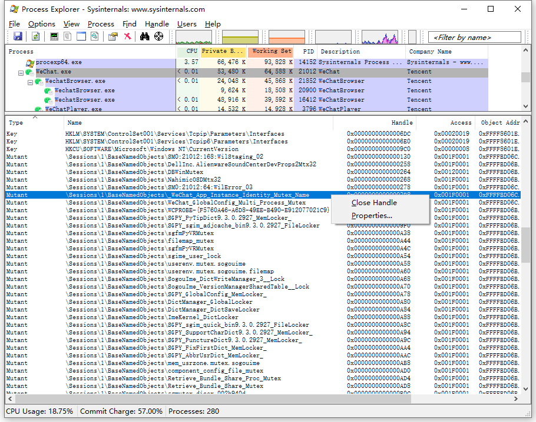

# 多客户端实现方法

为了防止客户端被多次启动，开发者们通常会使用创建互斥体（Mutex）对象的方式进行实现。互斥锁是一种用于多线程编程中，保护共享资源不被多个线程或进程同时访问的机制。

## Windows 中创建或打开互斥对象

### CreateMutexA function (synchapi.h)

```cpp
HANDLE CreateMutexA(
  [in, optional] LPSECURITY_ATTRIBUTES lpMutexAttributes,
  [in]           BOOL                  bInitialOwner,
  [in, optional] LPCSTR                lpName
);
```

### 参数

`[in, optional] lpMutexAttributes`

指向 [SECURITY_ATTRIBUTES] 结构的指针。如果此参数为`NULL`，则句柄不能被子进程继承。

结构的`lpSecurityDescriptor`成员指定新互斥体的安全描述符。如果`lpMutexAttributes`为`NULL`，则互斥锁将获得默认的安全描述符。互斥锁的默认安全描述符中的`ACL`来自创建者的主要或模拟令牌。

`[in] bInitialOwner`

如果此值为`TRUE`并且调用者创建了互斥锁，则调用线程将获得互斥锁对象的初始所有权。否则，调用线程不会获得互斥锁的所有权。要确定调用者是否创建了互斥锁，请参阅返回值部分。

`[in, optional] lpName`

互斥对象的名称。该名称仅限于`MAX_PATH`个字符。名称比较区分大小写。

如果`lpName`与现有的命名互斥对象的名称匹配，则此函数请求`MUTEX_ALL_ACCESS`访问权限。在这种情况下，将忽略`bInitialOwner`参数，因为它已由创建过程设置。如果`lpMutexAttributes`参数不为NULL，它决定句柄是否可以被继承，但它的安全描述符成员被忽略。

如果`lpName`为`NULL`，则创建互斥对象时没有名称。

如果`lpName`与现有事件、信号量、可等待计时器、作业或文件映射对象的名称匹配，则该函数将失败并且 [GetLastError] 函数返回`ERROR_INVALID_HANDLE`。这是因为这些对象共享相同的命名空间。

该名称可以具有“全局”或“本地”前缀，以在全局或会话命名空间中显式创建对象。名称的其余部分可以包含除反斜杠字符 (\) 之外的任何字符。有关详细信息，请参阅 内核对象命名空间。使用终端服务会话实现快速用户切换。内核对象名称必须遵循为终端服务概述的准则，以便应用程序可以支持多个用户。

该对象可以在私有命名空间中创建。有关详细信息，请参阅对象命名空间。

### 返回值

如果函数成功，则返回值是新创建的互斥对象的句柄（Handle）。

如果函数失败，则返回值为`NULL`。要获取扩展的错误信息，请调用 [GetLastError] 函数。

如果互斥锁是一个命名互斥锁并且该对象在此函数调用之前存在，则返回值是现有对象的句柄，并且 [GetLastError] 函数返回`ERROR_ALREADY_EXISTS`。

## 通过句柄关闭互斥体

### 使用 Process Explorer

Process Explorer 是 Microsoft 官方提供的用于找出进程已打开或加载的`Handle`和`DLL`信息的工具。

Process Explorer 官方页面：https://docs.microsoft.com/en-us/sysinternals/downloads/process-explorer

示例：

1. 以 WeChat 为例，首先启动 WeChat，在 [Process Explorer] 主界面中找到名为`WeChat.exe`进程并选中。

2. 然后在`Lower Pane`界面中找到`Type`为`Mutant`且`Name`为`\Sessions\1\BaseNamedObjects\_WeChat_App_Instance_Identity_Mutex_Name`的`Handle`。

3. 右键单击`Close Handle`关闭句柄后，即可启动一个新进程。




### Python代码实现

```python
handles = handler.find_handles(process_ids=[10000], handle_names=[r'\Sessions\1\BaseNamedObjects\_WeChat_App_Instance_Identity_Mutex_Name'])
handler.close_handles(handles)
```

参考源码：[client/handler/handler.py](../rpa-client/handler/handler.py)


[SECURITY_ATTRIBUTES]: https://docs.microsoft.com/en-us/previous-versions/windows/desktop/legacy/aa379560(v=vs.85)

[GetLastError]: https://docs.microsoft.com/en-us/windows/desktop/api/errhandlingapi/nf-errhandlingapi-getlasterror

[Process Explorer]: https://docs.microsoft.com/en-us/sysinternals/downloads/process-explorer

