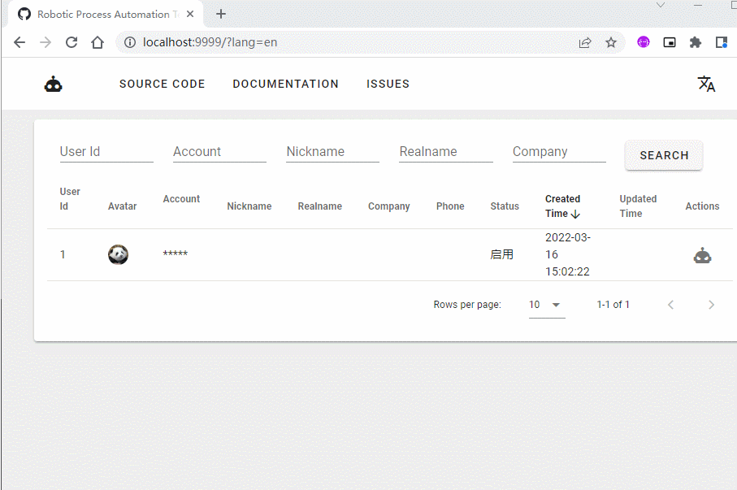
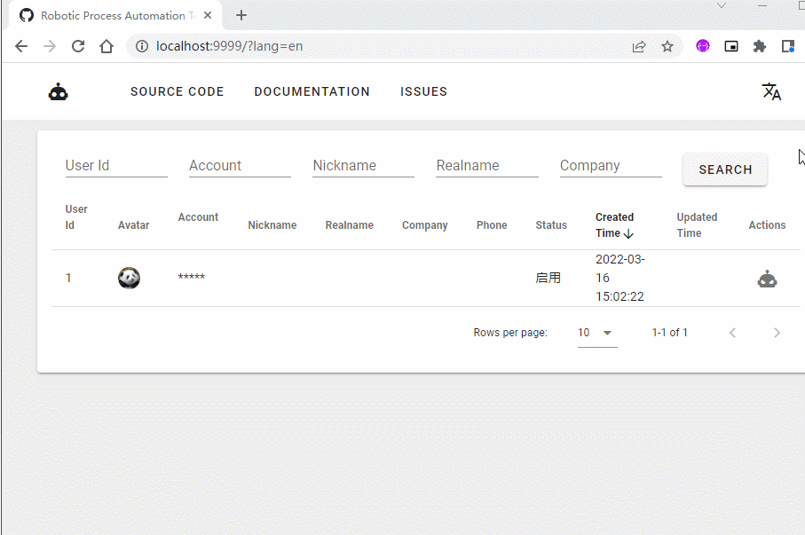

# 微信自动化使用方式

请确保已安装微信客户端，且`rpa-client`与`rpa-server`均已启动。

## 创建用户

### 通过HTTP接口创建用户

- 接口：`http://<host>:<port>/users`
- 方法：`POST`
- 参数：

| Property   | Type   | Required | Description          |
|:-----------|:-------|:---------|:---------------------|
| users      | User[] | 必填       | 用户对象数组。              |
| └ id       | String | 可选       | 用户ID。为空时，服务端会自动生成ID。 |
| └ appId    | String | 必填       | 关联AppID，微信为`wechat`。 |
| └ account  | String | 必填       | 用户账号，用于匹配客户端。        |
| └ nickname | String | 可选       | 用户昵称，用于展示。           |

示例：

```shell
curl -X POST --location "http://localhost:9999/users" \
    -H "Content-Type: application/json" \
    -d "{
          \"users\": [
            {
              \"id\": \"uid\",
              \"app_id\": \"wechat\",
              \"account\": \"account\",
              \"nickname\": \"nickname\"
            }
          ]
        }"
```

### 通过SQL脚本创建用户

```sql
INSERT INTO user (id, app_id, account, nickname, status, created_time)
VALUES ('uid', 'wechat', 'account', 'nickname', 1, now());
```

## 执行任务

#### 通过HTTP接口创建任务

- 接口：`http://<host>:<port>/tasks`
- 方法：`POST`
- 参数：

| Property       | Type     | Required | Description                                 |
|:---------------|:---------|:---------|:--------------------------------------------|
| tasks          | Task[]   | 必填       | 任务对象数组。                                     |
| └ id           | String   | 可选       | 任务ID。为空时，服务端会自动生成ID。                        |
| └ userId       | String   | 必填       | 关联用户ID。                                     |
| └ type         | String   | 必填       | 任务类型，参考[任务类型字典表](./app_task_type.md)。       |
| └ priority     | Integer  | 可选       | 任务优先级，值越小越优先。                               |
| └ data         | String   | 可选       | 任务数据。                                       |
| └ scheduleTime | DateTime | 可选       | 任务执行时间，例如：`2022-01-01 10:00:00`。为空时，表示立即执行。 |

示例：

```shell
curl -X PATCH --location "http://localhost:9999/tasks" \
    -H "Content-Type: application/json" \
    -d "{
          \"tasks\": [
            {
              \"id\": \"tid\",
              \"userId\": \"uid\",
              \"type\": \"login\",
              \"priority\": \"100\",
              \"data\": \"\",
              \"scheduleTime\": \"\",
            }
          ]
        }"
```

### 通过SQL脚本创建任务

```sql
INSERT INTO task (id, user_id, app_id, type, priority, data, status, created_time, schedule_time)
VALUES ('tid', 'uid', 'wechat', 'login', 0, null, 0, now(), now());
```

## 测试任务

打开浏览器访问`http://<host>:<port>/index.html`，可以在本地进行简单任务测试。

#### 登录任务



#### 登出任务



#### 发送个人消息任务

参数格式：

| Property  | Type      | Required | Description     |
|:----------|:----------|:---------|:----------------|
| target    | String    | 必填       | 发送对象。           |
| messages  | Message[] | 必填       | 消息对象数组。         |
| └ type    | Integer   | 必填       | 消息类型。           |
| └ content | String    | 必填       | 消息内容，文本内容或文件地址。 |

消息类型：

| Code | Name    | Description |
|:-----|:--------|:------------|
| 0    | TEXT    | 文本          |
| 1    | IMAGE   | 图片          |
| 2    | VIDEO   | 视频          |
| 3    | FILE    | 文件          |

参数示例：

```json
{
  "target": "friend_name",
  "messages": [
    {
      "type": 0,
      "content": "Greetings"
    },
    {
      "type": 1,
      "content": "https://rpa.leego.io/image.png"
    },
    {
      "type": 2,
      "content": "https://rpa.leego.io/video.mp4"
    },
    {
      "type": 3,
      "content": "https://rpa.leego.io/file.zip"
    }
  ]
}
```


#### 发送群消息任务

参数格式：

| Property  | Type      | Required | Description     |
|:----------|:----------|:---------|:----------------|
| target    | String    | 必填       | 群名称。            |
| messages  | Message[] | 必填       | 消息对象数组。         |
| └ type    | Integer   | 必填       | 消息类型。           |
| └ content | String    | 必填       | 消息内容，文本内容或文件地址。 |

消息类型：

| Code | Name    | Description |
|:-----|:--------|:------------|
| 0    | TEXT    | 文本          |
| 1    | IMAGE   | 图片          |
| 2    | VIDEO   | 视频          |
| 3    | FILE    | 文件          |
| 4    | MENTION | 提醒          |

参数示例：

```json
{
  "target": "friend_name",
  "messages": [
    {
      "type": 0,
      "content": "Greetings"
    },
    {
      "type": 1,
      "content": "https://rpa.leego.io/image.png"
    },
    {
      "type": 2,
      "content": "https://rpa.leego.io/video.mp4"
    },
    {
      "type": 3,
      "content": "https://rpa.leego.io/file.zip"
    },
    {
      "type": 4,
      "content": "mention_name"
    }
  ]
}
```
