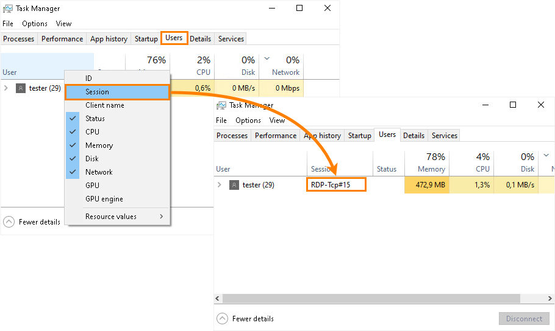

# 通过`tscon`保持Windows远程桌面关闭后仍可交互的方法

使用远程桌面连接到远程计算机时，关闭远程桌面会锁定计算机并显示登录屏幕。在锁定模式下，计算机没有`GUI`，因此任何当前运行或计划的`GUI`测试都将失败。

为避免`GUI`测试出现问题，可以使用`tscon`实用程序断开与远程桌面的连接。`tscon`将控制权返回到远程计算机上的原始本地会话，绕过登录屏幕。远程计算机上的所有程序继续正常运行，包括`GUI`测试。

## 什么是`tscon`？

`tscon`是Windows系统提供的可用于连接到远程桌面会话主机服务器上的另一个会话的工具。

## 如何使用`tscon`？

```shell
tscon {<sessionID> | <sessionname>} [/dest:<sessionname>] [/password:<pw> | /password:*] [/v]
```

| 参数                    | 描述                                                       |
|:----------------------|:---------------------------------------------------------|
| `<sessionID>`         | 指定要连接的会话的ID。如果使用可选`/dest:<sessionname>`参数，也可以指定当前会话的名称。  |
| `<sessionname>`       | 指定要连接的会话的名称。                                             |
| /dest:`<sessionname>` | 指定当前会话的名称。当您连接到新会话时，此会话将断开连接。您还可以使用此参数将另一个用户的会话连接到不同的会话。 |
| /password:`<pw>`      | 指定拥有要连接到的会话的用户的密码。当连接用户不拥有会话时，需要此密码。                     |
| /password:`*`         | 提示拥有您要连接的会话的用户的密码。                                       |
| /v                    | 显示有关正在执行的操作的信息。                                          |
| /?                    | 在命令提示符处显示帮助。                                             |

### 手动断开

要从远程桌面断开连接，请以管理员身份在远程计算机上（在远程桌面连接窗口中）运行以下命令，例如，通过命令行：

```shell
%windir%\System32\tscon.exe RDP-Tcp# NNN /dest:console
```

其中`RDP-Tcp# NNN`是当前远程桌面会话的`ID`，例如`RDP-Tcp#5`。您可以在**Windows任务管理器**的“**用户**”选项卡上的“**会话**”列中看到它。



您将看到您的远程桌面服务会话已结束消息，并且远程桌面客户端将关闭。但远程计算机上的所有程序和测试将继续正常运行。

提示：会话列默认隐藏。要显示它，请右键单击显示 CPU、内存等的行中的某处，然后在打开的上下文菜单中选择会话。

### 通过批处理文件断开连接

您可以使用批处理文件自动执行断开过程。在远程计算机上，执行以下操作：

1. 使用以下代码创建一个批处理文件：

```shell
for /f "skip=1 tokens=3" %%s in ('query user %USERNAME%') do (
  %windir%\System32\tscon.exe %%s /dest:console
)
```

2. 创建此文件的桌面快捷方式。为此，请右键单击批处理文件并选择发送到 > 桌面（创建快捷方式）。
3. 在快捷方式属性中，单击高级并选择以管理员身份运行。
4. 在远程计算机上双击此快捷方式（在远程桌面连接窗口中）或在测试开始时调用此批处理文件（前提是测试以管理员身份运行）。

## 注意事项

- `tscon`使远程计算机保持解锁状态，这会降低系统安全性。测试运行结束后，您可以使用以下命令锁定计算机：

    ```shell
    Rundll32.exe user32.dll, LockWorkStation
    ```

- 如果远程计算机上正在运行`rdpclip.exe`进程，并且当您从远程会话断开连接时剪贴板不为空，则`rdpclip.exe`进程可能会失败。

  为避免此问题，您可以在断开会话之前终止`rdpclip.exe`进程。

## 参考链接

- https://docs.microsoft.com/en-us/windows-server/administration/windows-commands/tscon
- https://support.smartbear.com/testcomplete/docs/testing-with/running/via-rdp/keeping-computer-unlocked.html